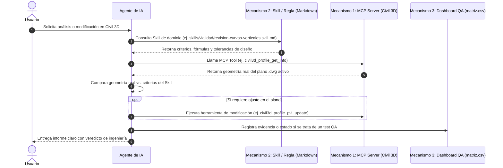

# GUÍA DE ARQUITECTURA Y MECANISMOS PARA AGENTES DE IA (AI AGENTS GUIDELINES)

Este repositorio unificado combina la capacidad de ejecución técnica sobre **Autodesk Civil 3D** con capacidades avanzadas de ingeniería, análisis de diseño y aseguramiento de calidad.

> [!IMPORTANT]
> **REGLA DE ORO PARA AGENTES DE IA:**
> Las herramientas de este proyecto pertenecen a **3 MECANISMOS DISTINTOS**. Nunca confundas la lectura de una regla de conocimiento con la ejecución de un comando en Civil 3D. Clasifica siempre la solicitud del usuario antes de responder.

---

## 🛠️ CLASIFICACIÓN DE MECANISMOS

### MECANISMO 1: Herramientas de Ejecución MCP (`server/`)
* **Ubicación:** Subcarpeta `server/` (Node.js/TypeScript + Plugin C# .NET `Civil3DMcpPlugin.dll`).
* **Naturaleza:** Protocolo MCP (Model Context Protocol).
* **Mecanismo de Invocación:** Llamadas directas a funciones MCP (`civil3d_...`).
* **Propósito:** Interactuar directamente con el documento `.dwg` activo en Civil 3D en tiempo real.
* **Cuándo Usar:**
  - Cuando se requiera **leer** datos geométricos del plano (alineamientos, cotas de superficie, perfiles, tuberías, puntos COGO).
  - Cuando se requiera **crear o editar** objetos dentro de Civil 3D (modificar un PVI, generar una superficie, crear puntos).
  - Ejemplo de herramientas: `civil3d_alignment_get_info`, `civil3d_surface_sample_elevation`, `civil3d_profile_pvi_update`.

### MECANISMO 2: Skills y Conocimiento Procedimental (`skills/` & `.agents/`)
* **Ubicación:** Carpetas `skills/` y `.agents/` (Archivos `.md` estructurados).
* **Naturaleza:** Contexto y heurísticas de ingeniería / diseño vial / topografía.
* **Mecanismo de Invocación:** Lectura de archivo Markdown / Inyección en prompt.
* **Propósito:** Enseñar a la IA los **criterios de diseño**, fórmulas, secuencias lógicas y falsos positivos *antes* de ejecutar nada en Civil 3D.
* **Cuándo Usar:**
  - Cuando el usuario pida realizar un análisis o revisión (ej. "Revisa las curvas verticales de la rasante").
  - La IA debe **leer la Skill correspondiente** primero para saber qué límites aplicar (ej. valores K mínimos, velocidad de diseño, longitud de curva).
  - Con el criterio obtenido de la Skill, la IA sabrá exactamente qué datos pedirle a las herramientas MCP del Mecanismo 1.

### MECANISMO 3: Matriz de Control de Calidad y Dashboard (`verificacion/` & `dashboard.html`)
* **Ubicación:** `verificacion/matriz.csv`, `dashboard.html`, `update_dashboard.py`.
* **Naturaleza:** Entorno de auditoría, pruebas reproducibles y panel visual.
* **Mecanismo de Invocación:** Ejecución de scripts Python o consulta del servidor HTTP local (`http://localhost:8000`).
* **Propósito:** Registrar evidencias de funcionamiento de cada herramienta MCP (`OK`, `WIP`, `FALLA`), evaluar compatibilidad entre versiones de Civil 3D y visualizar métricas globales.
* **Cuándo Usar:**
  - Tras verificar o probar el funcionamiento de una herramienta MCP en un dibujo de prueba.
  - Para actualizar y visualizar el estado del proyecto ejecutando `python update_dashboard.py`.

---

## 🔄 FLUJO ESTÁNDAR DE INTERACCIÓN DE LA IA

---

## 📋 REGLAS DE CONDUCTA PARA EL AGENTE
1. **Verifica siempre antes de modificar:** Nunca alteres un dibujo de producción sin haber leído primero la geometría existente mediante herramientas del Mecanismo 1.
2. **Prioriza el criterio sobre la fuerza bruta:** Consulta las Skills del Mecanismo 2 antes de tomar decisiones paramétricas.
3. **Mantén actualizado el laboratorio:** Si se crea una nueva Skill o se arregla un bug de una MCP Tool, ejecuta `python update_dashboard.py` para reflejar el avance en el Dashboard.
